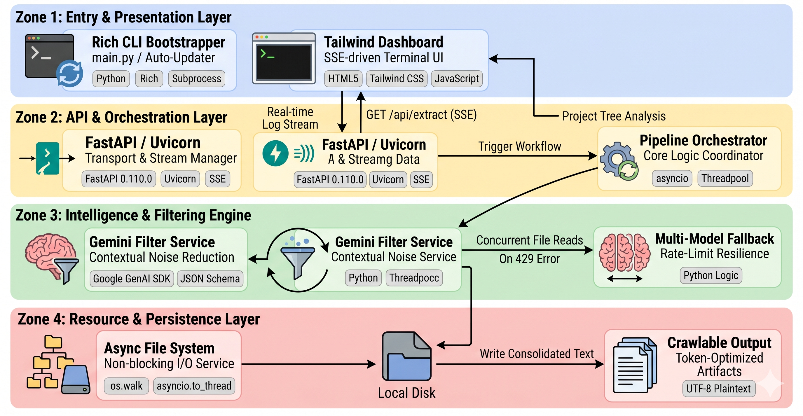
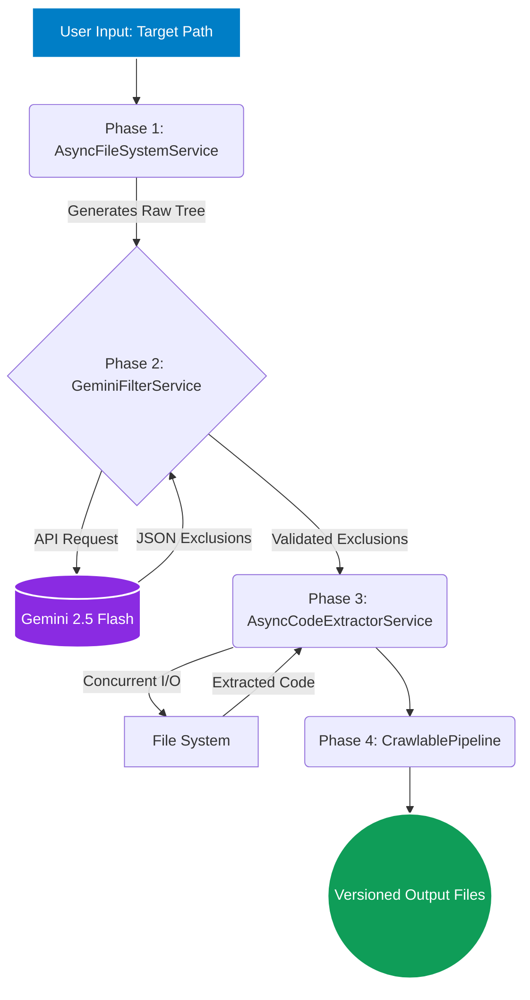

<div align="center">

# 🦅 Crawlable
**State-of-the-Art (SOTA) AI-Powered Codebase Extractor**

<a href="https://github.com/Med-Gh-TN/Crawlable/stargazers">
  
</a>
<a href="https://github.com/Med-Gh-TN/Crawlable/network/members">
  
</a>
<a href="https://github.com/Med-Gh-TN/Crawlable/issues">
  
</a>
<a href="https://github.com/Med-Gh-TN/Crawlable">
  
</a>

<br />

[](https://opensource.org/licenses/Apache-2.0)
[](https://www.python.org/downloads/)
[](https://ai.google.dev/)

*Stop manually copy-pasting code into ChatGPT. Let AI compress your entire repository into a single, token-optimized text file.*


## 🏗️ System Architecture

Crawlable operates on a highly decoupled, service-oriented architecture designed for fault tolerance and speed.

<div align="center">
  
</div>

<div align="left">

* **Phase 1: Structural Crawl (`AsyncFileSystemService`)**
  Generates a pre-filtered map of the directory, instantly applying `HARDCODED_EXCLUSIONS` (mathematically guaranteed noise) alongside the Smart Truncation algorithm.

* **Phase 2: Intelligent AI Filtering (`GeminiFilterService`)**
  Passes the roadmap to `gemini-2.5-flash` with a strict JSON schema prompt to dynamically identify project-specific noise. Engineered with exponential backoff and retry logic for API resilience.

* **Phase 3: Targeted Extraction (`AsyncCodeExtractorService`)**
  Fires off non-blocking `asyncio.gather` tasks to read all approved files concurrently, updating the `rich` UI progress bar via main-thread callbacks.

* **Phase 4: Output Generation (`CrawlablePipeline`)**
  Orchestrates the artifacts, assembling the final LLM-ready text files within version-controlled directories.

</div>

</div>

## 📖 Overview

Welcome to **Crawlable**. 

Feeding an entire software project to an AI model (like ChatGPT, Claude, or Gemini) for architectural review or aggressive refactoring is fundamentally broken by token limits. Accidentally uploading `node_modules`, `.git` histories, or compiled binaries destroys AI context windows.

**Crawlable engineers a solution.** It is an intelligent, highly concurrent CLI tool that scans your project directory and utilizes Google's **Gemini AI** to dynamically filter out infrastructural noise. It asynchronously extracts only the *core, proprietary source code*, compiling it into a token-optimized, human-readable artifact ready for immediate LLM ingestion.

---

## ✨ Key Features

- 🧠 **Dynamic AI Filtering:** Leverages Google Gemini 2.5 Flash to intelligently identify and exclude build artifacts, lock files, and useless dependencies based on context, not just hardcoded lists.
- ⚡ **Asynchronous Extraction:** Built on Python's `asyncio`, utilizing non-blocking I/O to parse hundreds of files concurrently for blazing-fast performance.
- 🛡️ **Smart Truncation Algorithm:** Automatically collapses massive directories (e.g., `venv`, `target`) in the generated project roadmap to preserve strict token economy.
- 🎨 **CLI Dashboarding:** Powered by the `rich` library, featuring live spinning progress bars, dynamic execution tables, and real-time status telemetry.
- 📦 **Versioned Output Management:** Automatically organizes extractions into timestamped, version-controlled directories (`/Crawlable_output/Project_YYYY-MM-DD_HH-MM/`).

---

## 🚀 "Zero to Hero" Setup

### Step 1: Environment Preparation
You require Python 3 to run this extractor.
- **Windows / macOS:** Download the latest release from [Python.org](https://www.python.org/downloads/). 
  > *Windows Users: Ensure you check **"Add Python to PATH"** during installation.*
- **Linux:** Install via your native package manager (e.g., `sudo apt install python3 python3-pip`).

### Step 2: Provision Google Gemini API Key
Crawlable's filtering engine requires an active Google AI API key.
1. Navigate to [Google AI Studio](https://aistudio.google.com/).
2. Authenticate and click **"Create API key"**.
3. Securely store the generated key.

### Step 3: Clone & Install Dependencies
Open your terminal and execute the following:

```bash
# Clone the repository
git clone [https://github.com/Med-Gh-TN/Crawlable.git](https://github.com/Med-Gh-TN/Crawlable.git)

# Navigate into the directory
cd Crawlable

# Install the required Python packages
pip install -r requirements.txt
# Note: On Linux/macOS, use `pip3` if `pip` is unassigned.
````

### Step 4: Configure Credentials

1.  Navigate to `src/config.py` in your code editor.
2.  Locate the `Config` class and inject your API key:
    ```python
    API_KEY = "YOUR_API_KEY_HERE"
    ```
3.  Save the configuration.

-----

## 💻 Cross-Platform Usage

Crawlable ships with native execution wrappers for all major operating systems.

### Windows

Execute the batch pipeline directly from your Command Prompt or by double-clicking the file:

```cmd
RUN_Crawlable.vbs
```

### Linux / macOS

Ensure the POSIX shell script is executable, then run it:

```bash
chmod +x run_crawlable.sh
./run_crawlable.sh
```

### Manual CLI Execution

To bypass interactive prompts, pass the absolute path of your target project directly to the Python engine:

```bash
python main.py /path/to/your/target/project
```

**Output Artifacts:**
Upon completion, navigate to the `Crawlable_output/` directory. Your versioned run will contain:

1.  `project_roadmap.txt`: A truncated, token-safe directory tree.
2.  `source_code.txt`: The AI-filtered, consolidated codebase.
3.  `prompt.txt`: A pre-configured prompt ready to paste into your LLM of choice.

-----

## 🏗️ System Architecture

Crawlable operates on a highly decoupled, service-oriented architecture designed for fault tolerance and speed.



1.  **Phase 1: Structural Crawl (`AsyncFileSystemService`)**
    Generates a pre-filtered map of the directory, instantly applying `HARDCODED_EXCLUSIONS` (mathematically guaranteed noise) alongside the Smart Truncation algorithm.
2.  **Phase 2: Intelligent AI Filtering (`GeminiFilterService`)**
    Passes the roadmap to `gemini-2.5-flash` with a strict JSON schema prompt to dynamically identify project-specific noise. Engineered with exponential backoff and retry logic for API resilience.
3.  **Phase 3: Targeted Extraction (`AsyncCodeExtractorService`)**
    Fires off non-blocking `asyncio.gather` tasks to read all approved files concurrently, updating the `rich` UI progress bar via main-thread callbacks.
4.  **Phase 4: Output Generation (`CrawlablePipeline`)**
    Orchestrates the artifacts, assembling the final LLM-ready text files within version-controlled directories.

-----

## 🤝 Contributing

We are building the open-source standard for AI code extraction. Contributions are highly welcomed.

1.  Fork the Project
2.  Create your Feature Branch (`git checkout -b feature/SOTA-Feature`)
3.  Commit your Changes (`git commit -m 'feat: implement SOTA-Feature'`)
4.  Push to the Branch (`git push origin feature/SOTA-Feature`)
5.  Open a Pull Request

-----

## 📜 License

Distributed under the Apache 2.0 License. See `LICENSE` for more information.


<div align="center"\>
  <b>Built with ❤️ by \<a href="https://github.com/Med-Gh-TN"\>Mouhamed Gharsallah</a></b>b><br>
  <i>Empowering seamless AI collaboration for software engineers globally.</i>
</div>

